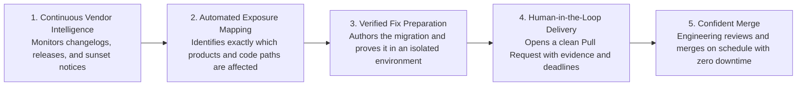

# Fix API

<div align="center">

# The Autonomous Control Plane for External API & Software Dependency Changes

### Protecting businesses from the silent failure of third-party APIs, deprecations, and upstream breaking changes.

<p align="center">
  <b>When an external provider changes an API, runNexus discovers every impacted workflow in your software, proves the fix, and delivers a reviewable pull request before production breaks.</b>
</p>

[The Problem](#the-cost-of-unnoticed-api-changes) •
[The Solution](#the-runnexus-solution) •
[Business Value](#business-value--roi) •
[Market Positioning](#how-runnexus-compares) •
[Key Capabilities](#key-product-capabilities) •
[Trust & Governance](#trust-security--governance)

---

</div>

## Executive Summary

Modern applications depend on dozens of mission-critical third-party services — payment infrastructure, AI models, communication APIs, identity providers, and cloud platforms.

Every year, these providers publish hundreds of API deprecations, field retirements, payload modifications, and sunset deadlines. When a provider changes how their service operates:

- **Manifests don't change** — Traditional dependency bots stay silent because package versions remain unchanged.
- **Code doesn't change** — Your repository looks clean and your current tests continue to pass against outdated assumptions.
- **Production breaks silently** — When the vendor's sunset date arrives, customer payments fail, notifications stop delivering, or critical features go offline.

**runNexus** is the dedicated control plane that bridges the gap between **upstream vendor changes** and **downstream application code**. We monitor external providers 24/7, pinpoint your exact business exposure, and deliver tested, ready-to-merge pull requests well in advance of vendor deadlines.

---

## The Cost of Unnoticed API Changes

Engineering teams are caught in a reactive cycle with third-party software dependencies:

> _"Over 30% of service downtime in modern cloud architectures is caused by unnoticed external API and dependency changes."_

### Why the Industry Has a Blind Spot

```
Upstream API Vendor                       Your Application
─────────────────────                     ────────────────
External API provider                     • No code changes made
deprecates an endpoint or                 • Package versions look up-to-date
alters a response payload                 • CI test suite passes 100%
        │                                         │
        ▼                                         ▼
┌────────────────────────────────────────────────────────┐
│                   THE VISIBILITY GAP                   │
│   Existing tools watch files inside your repository.   │
│   Nobody connects external vendor announcements to     │
│   the exact lines of business code that depend on them.│
└────────────────────────────────────────────────────────┘
        │
        ▼
Months later: The vendor sunsets the feature.
Result: Silent production outages, failed transactions, and midnight emergency fire drills.
```

---

## The runNexus Solution

runNexus transforms reactive emergency firefighting into an automated, predictable workflow:



1. **Continuous Vendor Intelligence**: We monitor official provider feeds, changelogs, SDK updates, and deprecation notices across a continuously expanding catalog of third-party APIs and services.
2. **Automated Exposure Mapping**: When a vendor announces a change, runNexus instantly determines which products, repositories, and workflows are affected — without requiring developers to manually audit codebases.
3. **Verified Remediation**: Instead of vague alerts, runNexus prepares the precise code migration and validates it in an isolated, security-hardened environment before any code touches your repository.
4. **Human-in-the-Loop Pull Requests**: Your engineering team receives a complete Pull Request containing the diff, vendor documentation links, sunset deadlines, and automated test proof. Engineers retain full review and merge authority.

---

## Business Value & ROI

### 🛡️ Eliminate Silent Production Incidents

Stop external API deprecations from surprising your customers. Upstream changes are detected and resolved weeks or months before provider sunset deadlines.

### ⏱️ Reclaim Valuable Engineering Hours

Eliminate manual changelog tracking, frantic codebase audits, and high-stress emergency migrations. Free your senior developers to focus on core product innovation.

### 📊 Complete Vendor Risk Visibility

Maintain an always-accurate, real-time inventory of all external services and APIs your organization depends on, complete with health indicators and deprecation timelines.

### 🔒 Zero Production Secrets Required

Verification happens against provider specifications and existing test suites in isolated sandboxes. runNexus never requests or requires live production credentials or third-party API keys.

---

## How runNexus Compares

| Solution Type                                       | What Triggers It               | Where It Falls Short                                                                                        | The runNexus Advantage                                                                                           |
| :-------------------------------------------------- | :----------------------------- | :---------------------------------------------------------------------------------------------------------- | :--------------------------------------------------------------------------------------------------------------- |
| **Package Updaters** _(Dependabot, Renovate)_       | New package version published  | Completely silent when external services change their behavior without a version bump.                      | **Service-Aware**: Detects vendor behavior changes and updates integrations regardless of manifest status.       |
| **Vulnerability Scanners** _(Snyk, Socket)_         | Known CVE or security advisory | Blind to functional deprecations, endpoint retirements, and payload changes that aren't security flaws.     | **Lifecycle-Focused**: Tracks API deprecations, migrations, and sunset roadmaps across all providers.            |
| **API Monitoring Dashboards**                       | Specification diffs or alerts  | Generates alerts in an external dashboard with zero understanding of where your code is exposed.            | **Code-Connected**: Connects upstream vendor changes directly to your repositories and delivers the fix.         |
| **Generic Coding Assistants** _(Copilot, Chatbots)_ | Manual engineer prompts        | Entirely reactive: requires a human to discover the issue, understand the changelog, and write the prompts. | **Autonomous & Proactive**: Discovers the change, maps the impact, proves the fix, and opens the PR proactively. |

> **Bottom Line:** _Other tools update libraries or flag security alerts after the fact. runNexus ensures your business workflows never break when external services change._

---

## Key Product Capabilities

### 📬 Actionable Change Inbox

A centralized management feed prioritizing external vendor changes by urgency, severity, and business impact. Track approaching provider sunsets across your entire organization.

### 🧩 Product & Workspace Isolation

Organize repositories by business domains, microservices, or product teams. Each product maintains its own dedicated change inbox, impact findings, and pull requests, while leadership gets an organization-wide overview.

### 🔍 Deep Integration Inventory

Gain continuous visibility into every third-party service, SDK, and external API surface consumed across your organization's software estate.

### 🧪 Pre-Flight Verification Sandboxes

Every proposed migration is compiled and tested in an isolated, egress-denied environment using your repository's existing test suite. Only changes that provably pass are presented as Pull Requests.

### 📬 Context-Rich Pull Requests

Pull requests arrive with everything an engineer needs to approve in minutes:

- Exact business context and migration rationale.
- Direct links to official provider announcements and changelogs.
- Official sunset and retirement deadlines.
- Verification logs showing passing tests and typechecks.

---

## Trust, Security & Governance

runNexus is engineered specifically for organizations where security, intellectual property, and reliability are paramount:

- **Human-in-the-Loop**: runNexus never automatically merges code into your production branches. Your engineers always retain full review and approval control.
- **Metadata-First Architecture**: runNexus maps integration facts and structural relationships without storing or transmitting proprietary application code.
- **Egress-Denied Execution**: Verification sandboxes run strictly without internet access, ensuring zero data leakage or unauthorized outbound communication.
- **No Live Vendor Secrets**: Tests run against provider specifications and your existing test doubles. We never handle your live third-party API keys, production tokens, or database credentials.
- **Enterprise Deployment Options**: Available as a managed Cloud service, an on-premises Enterprise Broker (keeping code inside your perimeter), or fully air-gapped environments.

---

## Target Audience & Use Cases

- **Fast-Growing Scale-ups**: Move fast without accumulating hidden integration debt or suffering customer-facing payment and communication outages.
- **Enterprise Engineering Leaders**: Gain unified governance and proactive risk management across hundreds of microservices and dozens of third-party vendors.
- **Fintech & Mission-Critical Systems**: Protect mission-critical payment gateways, identity verification systems, and regulatory reporting integrations from unexpected API shifts.

---

<div align="center">
  <sub>Built for resilient, self-maintaining software. Powered by runNexus.</sub>
</div>
